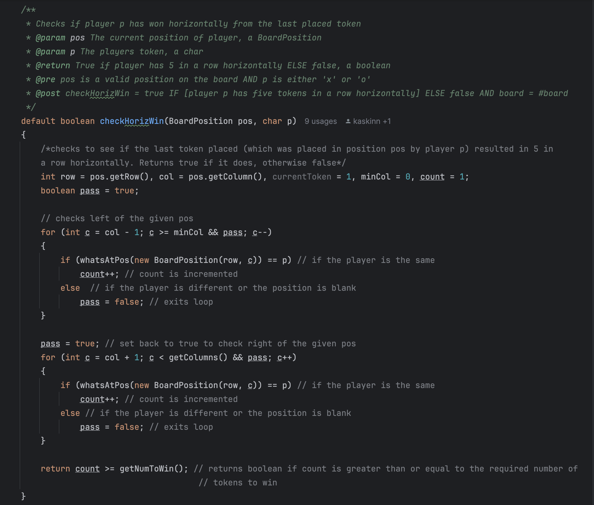

# Coding Projects

## Software Dev Foundations
In this course, we undertook a semester-long Connect4 coding project, which emphasized collaboration and applying foundational software development principles. My team and I gained experience in key areas, including:
- Writing proper documentation to ensure code clarity and maintainability.
- Implementing unit testing to validate functionality and maintain quality.
- Leveraging advanced programming techniques such as interfaces, abstract classes, factory patterns, and the observer design pattern.
- Hosting and managing our project using GitHub for version control and collaboration.
Below is the implementation of my project, showcasing the skills and concepts learned throughout the semester.

### Documentation

### Unit testing

### Abstraction/Interfaces

    
    

